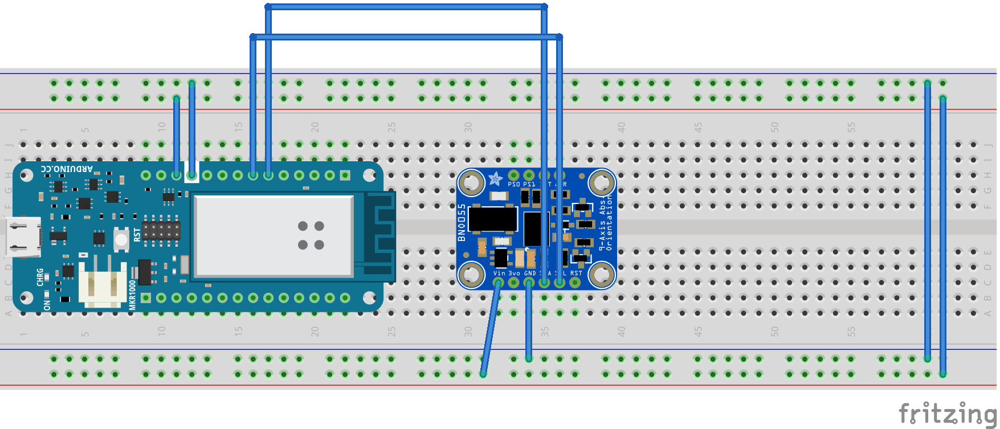

# Arduino MKR1000 + BNO055 + Neopixel <—> cables

In this example you will learn how to connect a motion sensor (*BNO055*) to an *Arduino MKR1000*, how to send it’s sensor data to cables (via [MQTT](http://mqtt.org)) and how to use it a rotate a cube on your screen.

## Wiring

- | Arduino MKR1000 Pin | BNO055 Pin |
  | ------------------- | ---------- |
  | SDA                 | SDA        |
  | SCL                 | SCL        |
  | Ground (GND)        | GND        |
  | VCC                 | VIN        |

